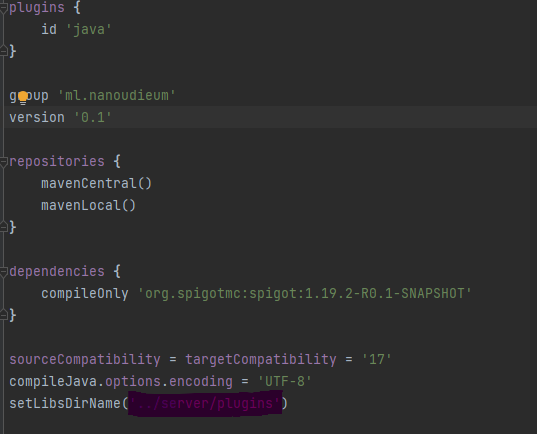

Nia !

SUIVRE TOUTE LES ETAPES
Pour compiler le plugin il vous faut Intellij IDEA et java 17, après avoir ouvert le project rendez-vous dans build.gradle (ou vous pouvez choisir de modifier l'endroit ou le plugin sera compiler voir après) et cliquez sur l'éléphant si il n'apparait pas alors en haut a gauche cliquez sur le bouton vert en forme de flèche et qu'il y est bien Nia [build] a gauche.

Modifier tout le surlignez mais gardez BIEN les parenthèses et les apostrophes 

exemple si vous mettez ça : ('..') le fichier se retrouvera a la racine du project.
exemple si vous mettez ça : ('../plugin') le fichier se retrouvera dans un nouveau dossier nommez plugin

bref si vous n'y arrivez mettez un commentaire ;)
